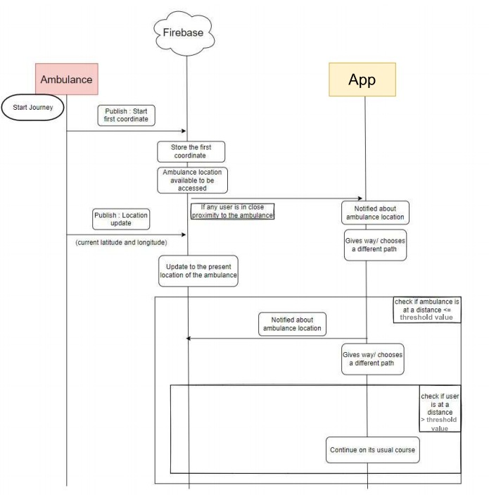

# Ambulance Path Clearance 🚑

##  Problem Statement
Traffic management is something that is often overlooked. 
As a consequence, ambulances at times do not have a clear path to 
take and end up becoming a part of the congestion.  
At crossroads, traffic signals are manually turned green to give clearance for an ambulance to pass.  
This might lead to casualties as time is of utmost importance.

## Solution
An Application service that :

- Notifies the vehicles about the ambulance’s location when the vehicle is at a particular distance from the ambulance.

- Ambulance choose the fastest route to reach the hospital  
    - Based on features like : potholes, traffic etc.
- Traffic signal light turns green when the ambulance is at a close proximity range from the traffic pole. 

## Team Members

- [Tejaal M](https://www.github.com/Rahul-KP) 
- [Amitash M S](https://www.github.com/Rahul-KP) 
- [Syed Adnan Mohammed](https://www.github.com/Rahul-KP) 
- [Rahul K P](https://www.github.com/Rahul-KP) 
- [Sumedh Hagaldivte](https://www.github.com/Rahul-KP) 

## Work Flow

## Approach

When we open the app we get two choose a role:
  - Ambulance Driver
  - User 

  #### Ambulance Driver:

  Will be provided with a set of options, like layers of map, based on which they can choose the an route to cummute.
  The layers could be based on amount of potholes present on the particular road, the amount of traffic on the route, average speed of the vehicles on that route etc.

  #### User:

  Based on the route that's chosen by the ambulance driver , the users who are in a close proximity range of the ambulance are notified about the ambulance's location, along with which the user is also displayed the route on which the ambulance is going to commute form its location to the hospital. 

#### Traffic Light Pole:

The ambulance needs to reach the hospital as soon as possible.  
The ambulance is fitted with an IoT device that is connected to the internet .
Every few seconds the signals are sent via IoT device using ESP8266 to a channel.
Every traffic pole is subscribed to the channel. 
The pole will have the hardcoded information of its current location 
As the traffic pole is subscribed to the channel it will get the GPS coordinates of the ambulance , when an ambulance is in close proximity to the traffic pole.
And then the traffic  signal light  will turn green.

